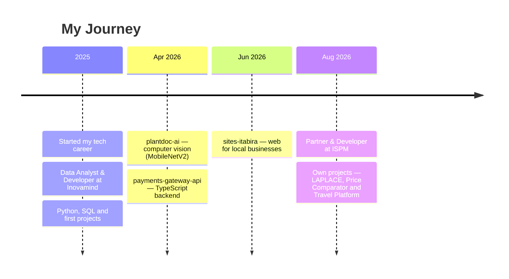

<a href="./README.md">🇧🇷 Português</a> &nbsp;·&nbsp; <b>🇺🇸 English</b>

<!-- HEADER BANNER -->

<!-- TYPING SVG -->

 

<!-- SOCIAL BADGES -->

---

## 👋 About Me

- 🤝 **Partner & developer** at **ISPM Consultoria & Facilities**
- 🎓 **Computer Engineering** student
- 🤖 I build **conversational AI agents** (sales/support) — Python, RAG, LLM APIs, WhatsApp
- 🛠️ **Backend & full-stack** — TypeScript, Node.js, Next.js, React, FastAPI, Tailwind, Supabase
- 📊 **Data analysis** — Python (Pandas, NumPy), SQL, PostgreSQL
- 📱 I also build **mobile apps** (iOS/Android), **games** (Unity) and work with **digital art** (Krita)
- 💼 **Experience:** [ISPM Consultoria & Facilities](https://ispmtecnologia.com.br) · [Inovamind](https://www.inovamind.dev)

> I turn ideas into products: from AI automation to the backend that keeps operations running.

---

## 🚀 Projects

<table>
<tr>
<td width="33%" valign="top">

**💰 [Price Comparator](https://comparador-precos-mvp.vercel.app)** 
Automated **e-invoice (NF-e)** analysis: reads the XML, classifies by category and points to the cheapest supplier + unusual-increase alerts. 
`Next.js` `React` `Supabase` 
🔗 Live · 🔒 Private code

</td>
<td width="33%" valign="top">

**✈️ [Travel Platform](https://viagem-caldas-novas.vercel.app)** 
3-in-1: group cost-splitting, live hotel search (LiteAPI) and a partner portal. Serverless + Supabase. 
`Vercel` `Serverless` `Supabase` 
🔗 Live · 🔒 Private code

</td>
<td width="33%" valign="top">

**🎬 [Hora de Dramear](https://horadedramear.com.br)** 
Content platform for Asian-drama fans: blog, newsletter, voting, awards and search. 
`Web` `SEO` `Content` 
🔗 Live · 🔒 Private code

</td>
</tr>
<tr>
<td width="33%" valign="top">

**📈 [Contempla Já](https://contempla-ja.alexandreediego220.workers.dev/#/app)** 
Consortium-award probability simulator, with invite-only login and per-seller history. 
`React` `Supabase` `Cloudflare Workers` 
🔗 Live · 🔒 Private code

</td>
<td width="33%" valign="top">

**🏢 [ISPM Website](https://ispm.com.br)** 
ISPM's institutional site with the *ISPM Mapping* — a 10-step questionnaire that generates leads. 
`Static` `Supabase` `Edge Functions` 
🔗 Live · 🔒 Private code

</td>
<td width="33%" valign="top">

**🤖 24/7 Sales AI Agent** 
Conversational sales agent on WhatsApp with a pluggable *ports* architecture (catalog, shipping, payment, CRM). 
`Python` `RAG` `LLM APIs` 
🔒 Private code

</td>
</tr>
<tr>
<td width="33%" valign="top">

**💳 [payments-gateway-api](https://github.com/diego-caldeira-12/payments-gateway-api)** 
Mock payment gateway: idempotency, webhooks and async processing. 
`TypeScript` `Node.js` 
`</>` Public code

</td>
<td width="33%" valign="top">

**🌿 [plantdoc-ai](https://github.com/diego-caldeira-12/plantdoc-ai)** 
Computer vision for plant-disease identification (MobileNetV2, transfer learning). 
`Python` `TensorFlow` 
`</>` Public code

</td>
<td width="33%" valign="top">

**🏬 [sites-itabira](https://github.com/diego-caldeira-12/sites-itabira)** 
Professional websites for local businesses in Itabira/MG. 
`HTML` `CSS` `JS` 
`</>` Public code

</td>
</tr>
<tr>
<td width="33%" valign="top">

**🧠 LAPLACE** 
Autonomous quantitative research platform for trading: multi-agent, backtesting and a risk module with veto (*LLMs never decide trades*). 
`Python` `Quant` `Multi-agent` 
🔒 Private code

</td>
<td width="33%" valign="top">

**📊 Reconciliation & management dashboards** 
SaaS dashboards for financial and logistics operations. 
`React` `Node.js` `PostgreSQL` 
🔒 Private code

</td>
<td width="33%" valign="top">

**📱 Mobile apps** 
iOS + Android apps for logistics operations. 
`Mobile` `iOS` `Android` 
🔒 Private code

</td>
</tr>
</table>

---

## 🛠️ Tech Stack

**Languages**
 

**AI & Automation**
 

**Backend & Web**
 

**Databases**
 

**DevOps, Testing & Tools**
 

**Mobile, Games & Design**
 

<b>📋 Full skill list</b>

 

| Category | Technologies |
|----------|-------------|
| **Languages** | TypeScript, JavaScript, Python, C#, C++, Java, HTML, CSS, SQL, Bash, PowerShell |
| **AI & Automation** | Claude / Claude Code, OpenAI, LLM APIs, Conversational AI agents, RAG, n8n, WhatsApp API, TensorFlow |
| **Backend & Web** | Node.js, Next.js, React, Vite, FastAPI, Tailwind, shadcn/ui, Supabase, Vercel, Jinja2, SQLAlchemy |
| **Data** | Python (Pandas, NumPy), SQL, Data Analysis |
| **Databases** | PostgreSQL, MySQL, MongoDB, SQLite |
| **DevOps & Infra** | Git, GitHub, GitHub Actions, Docker, Linux, Cloudflare, VS Code, Sentry |
| **Testing & APIs** | Vitest, Playwright, Postman, Resend, LiteAPI |
| **Mobile, Games & Design** | iOS, Android, Unity, C# Scripting, Blender, Figma, Krita |

---

## 📜 Journey

---

## 📊 GitHub Stats

  

  

---

## 📈 Activity

 

---

## 🏙️ 3D Contribution Skyline

<picture>
  
</picture>

> *3D skyline of my contributions — updated automatically via GitHub Actions*

---

## 🎵 Now Playing

---

<b>❤️ By <a href="https://github.com/diego-caldeira-12">Diego Caldeira</a></b>

