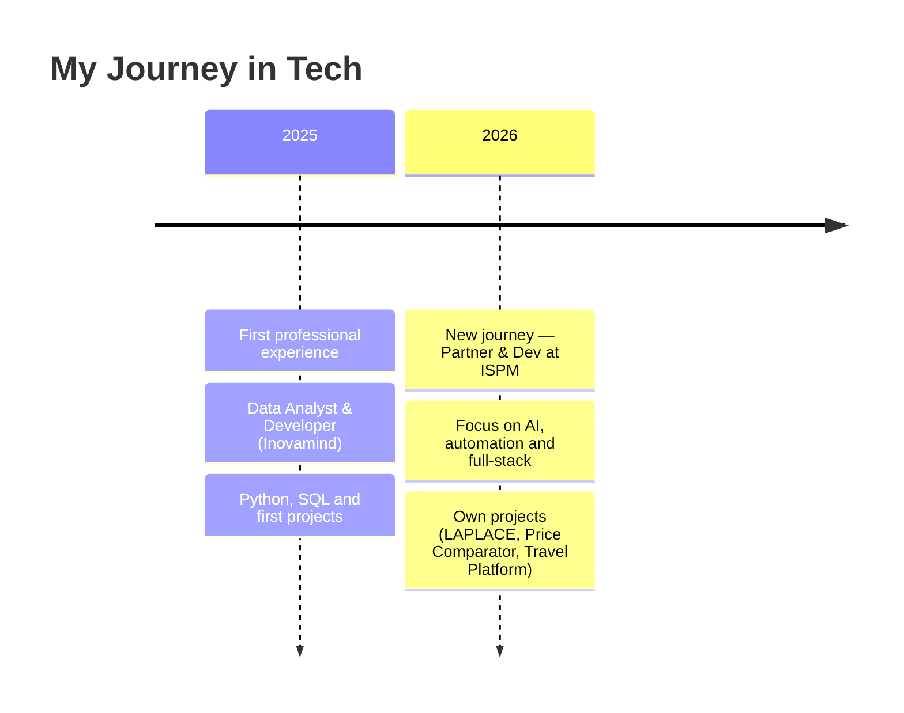

<div align="center">

<a href="./README.md">🇧🇷 Português</a> &nbsp;·&nbsp; <b>🇺🇸 English</b>

<!-- HEADER BANNER -->


<!-- TYPING SVG -->
<a href="https://git.io/typing-svg">
  
</a>

<br/>

<!-- SOCIAL BADGES -->
<a href="https://www.linkedin.com/in/diego-caldeira-60148519b/">
  
</a>
<a href="https://www.instagram.com/diegocaldeira_/">
  
</a>
<a href="https://github.com/diego-caldeira-12">
  
</a>


</div>

---

## 👋 About Me

- 🤝 **Partner & developer** at **ISPM Consultoria & Facilities**
- 🎓 **Computer Engineering** student
- 🤖 I build **conversational AI agents** (sales/support) — Python, RAG, LLM APIs, WhatsApp
- 🛠️ **Backend & full-stack** — TypeScript, Node.js, Next.js/React, Supabase
- 📊 Solid foundation in **data analysis** (Python, SQL)
- 💼 Previously: **Inovamind** (data analyst & developer) — now on a new journey at ISPM
- 🎮🎨 Also into **games** (Unity) and **digital art** (Krita)

> I turn ideas into products: from AI automation to the backend that keeps operations running.

---

## 🚀 Products & Projects

<table>
<tr>
<td width="33%" valign="top">

**💰 Price Comparator**

Automated **e-invoice (NF-e)** analysis: reads the XML, classifies by category and points to the cheapest supplier + unusual-increase alerts.

`Next.js` · `React` · `Supabase`
<br/>🔒 private code · piloting

</td>
<td width="33%" valign="top">

**✈️ [Travel Platform](https://viagem-caldas-novas.vercel.app)**

3-in-1: group cost-splitting, live hotel search (LiteAPI) and a partner portal. Serverless + Supabase.

`Vercel` · `LiteAPI` · `Supabase`
<br/>🔗 **live**

</td>
<td width="33%" valign="top">

**🎬 [Hora de Dramear](https://horadedramear.com.br)**

Content platform for Asian-drama fans: blog, newsletter, voting, awards and search.

`Web` · `Content` · `SEO`
<br/>🔗 **live**

</td>
</tr>
<tr>
<td width="33%" valign="top">

**📈 Contempla Já**

Consortium-award probability simulator, with invite-only login and per-seller history.

`Vite` · `React` · `Supabase`
<br/>🔒 private code · phase 1

</td>
<td width="33%" valign="top">

**🏢 [ISPM Website](https://ispm.com.br)**

ISPM's institutional site with the *ISPM Mapping* — a 10-step questionnaire that generates leads.

`Static` · `Supabase` · `Edge Functions`
<br/>🔗 **live**

</td>
<td width="33%" valign="top">

**🤖 24/7 Sales AI Agent**

Conversational sales agent on WhatsApp with a pluggable *ports* architecture (catalog, shipping, payment, CRM).

`Python` · `RAG` · `LLM APIs`
<br/>🔒 private

</td>
</tr>
</table>

---

## 💻 Public Code

My open repositories — where you can see real code:

| Repository | What it is | Stack |
|------------|-----------|-------|
| **[payments-gateway-api](https://github.com/diego-caldeira-12/payments-gateway-api)** | Mock payment gateway: idempotency, webhooks and async processing |  |
| **[plantdoc-ai](https://github.com/diego-caldeira-12/plantdoc-ai)** | Computer vision for plant-disease identification (MobileNetV2, transfer learning) |  |
| **[sites-itabira](https://github.com/diego-caldeira-12/sites-itabira)** | Professional websites for local businesses in Itabira/MG |  |

---

## 🧩 More work

- 🧠 **LAPLACE** — autonomous quantitative research platform for trading (multi-agent, backtesting, risk module with veto; *LLMs never decide trades*). `🔒 private`
- 📊 **Reconciliation & management dashboards** — SaaS dashboards for financial and logistics operations. `🔒 private`
- 📱 **Mobile apps** — iOS + Android apps for logistics operations. `🔒 private`

---

## 🛠️ Tech Stack

<div align="center">

**Languages**
<br/>


**AI & Automation**
<br/>


**Backend & Web**
<br/>


**Databases**
<br/>


**DevOps & Tools**
<br/>


**Also**
<br/>


</div>

<details>
<summary><b>📋 Full skill list</b></summary>
<br/>

| Category | Technologies |
|----------|-------------|
| **Languages** | TypeScript, JavaScript, Python, C#, C++, Java, HTML, CSS, SQL |
| **AI & Automation** | Conversational AI agents, RAG, LLM APIs, n8n, WhatsApp API, TensorFlow |
| **Backend & Web** | Node.js, Next.js, React, FastAPI, Tailwind, Supabase, Vercel |
| **Data** | Python (Pandas, NumPy), SQL, Data Analysis |
| **Databases** | PostgreSQL, MySQL, MongoDB, SQLite |
| **DevOps & Tools** | Git, GitHub, Docker, Linux, VS Code |
| **Also** | Unity, C# Scripting, Blender, Figma, Krita |

</details>

---

## 📜 Journey

<div align="center">



</div>

---

## 📊 GitHub Stats

<div align="center">


<br/><br/>


</div>

---

## 📈 Activity

<div align="center">


<br/>


</div>

---

## 🏙️ 3D Contribution Skyline

<div align="center">

<picture>
  
</picture>

> *3D skyline of my contributions — updated automatically via GitHub Actions*

</div>

---

## ⏱️ Coding Time

<div align="center">

<!--START_SECTION:waka-->
```
⌛ Collecting WakaTime data... it shows up here automatically.
```
<!--END_SECTION:waka-->

</div>

---

## 🎵 Now Playing

<div align="center">

[](https://spotify-github-profile.kittinanx.com/api/view?uid=ubcxazybcxy2yaqjy7npdgnub&redirect=true)

</div>

---

<div align="center">


<b>❤️ By <a href="https://github.com/diego-caldeira-12">Diego Caldeira</a></b>

</div>
