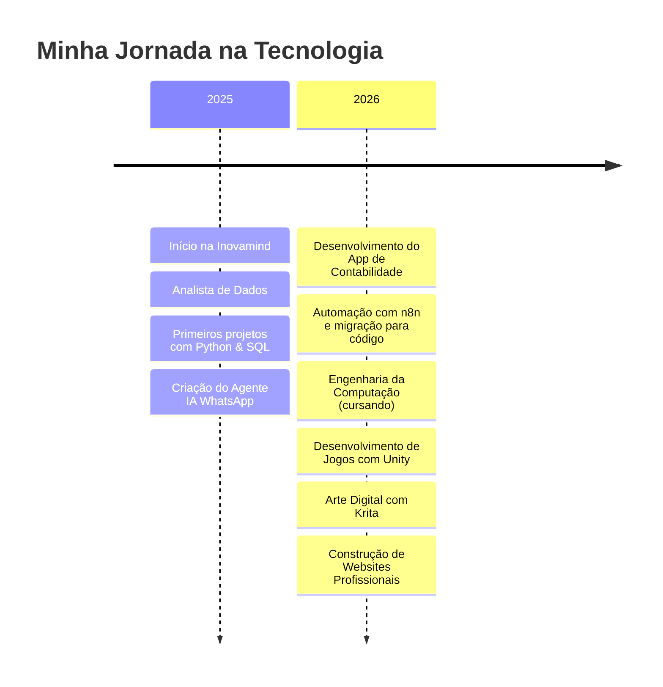
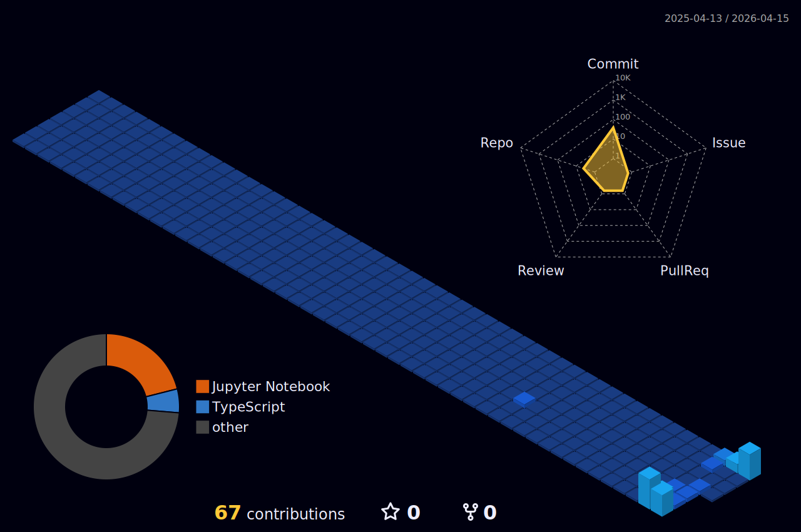

<div align="center">

<!-- HEADER BANNER -->


<!-- TYPING SVG -->
<a href="https://git.io/typing-svg">
  
</a>

<br/>

<!-- SOCIAL BADGES -->
<a href="https://www.linkedin.com/in/diego-caldeira-60148519b/">
  
</a>
<a href="https://www.instagram.com/diegocaldeira_/">
  
</a>
<a href="https://github.com/diego-caldeira-12">
  
</a>


</div>

---

##  &nbsp;Sobre Mim

```yaml
nome: Diego Nunes Caldeira
localização: Brasil 🇧🇷
empresa: Inovamind
formação: Engenharia da Computação (cursando)
cargo_atual: Analista de Dados & Desenvolvedor Júnior
hobbies: Desenvolvimento de Jogos 🎮 | Arte Digital 🎨
```


- 🎓 Estudante de **Engenharia da Computação**
- 💼 Trabalho como **Analista de Dados** e **Desenvolvedor Júnior**
- 🎮 Nas horas livres, **desenvolvo jogos** com Unity
- 🤖 Criei um **Agente de IA** que funciona como vendedor humano 24/7 no WhatsApp
- 🔧 Experiência com **automação via n8n** e migração para código
- 📱 Desenvolvimento de **aplicativos** para empresas de contabilidade
- 🎨 Pratico **arte digital** com mesa digitalizadora usando Krita
- 🌐 Construção de **websites** profissionais
- 🚀 Sempre aprendendo e buscando novos desafios

<br clear="right"/>

---

## 🗺️ Roadmap 2026

<div align="center">

```
  ✅ Concluído    🔄 Em andamento    ⬜ Planejado
```

| Status | Meta | Detalhes |
|:---:|------|---------|
| ✅ | **Agente IA WhatsApp** | Vendedor autônomo 24/7 com n8n → código |
| ✅ | **App Contabilidade** | Aplicativo completo para empresa de contabilidade |
| 🔄 | **Jogo em Unity** | Primeiro jogo em desenvolvimento com C# |
| 🔄 | **Arte Digital** | Aprimorando habilidades com Krita e mesa digitalizadora |
| ⬜ | **Contribuir para Open Source** | 5+ contribuições em projetos relevantes |
| ⬜ | **Certificação Cloud** | AWS ou Azure fundamentals |
| ⬜ | **TypeScript Avançado** | Dominar TypeScript para projetos profissionais |
| ⬜ | **Portfolio Online** | Website pessoal profissional |

</div>

---

## 📜 Timeline Profissional

<div align="center">



</div>

---

## 🚀 Projetos em Destaque

<div align="center">

<a href="#">
  
</a>

</div>

<br/>

<div align="center">

| 🤖 **Agente IA - Vendedor WhatsApp** | 📱 **App Contabilidade** |  🌐 **Websites** | 🎮 **Jogo (em desenvolvimento)** |
|:---:|:---:|:---:|:---:|
| Agente inteligente que funciona como vendedor humano 24/7, criado com n8n e depois migrado para código | Aplicativo completo desenvolvido para empresa de contabilidade | Sites profissionais para clientes e projetos pessoais | Jogo em desenvolvimento usando Unity e C# |

</div>

---

## 🛠️ Tech Stack

<div align="center">

### 💻 Linguagens de Programação


### 🎮 Game Development


### 🎨 Arte Digital & Design


### 🗃️ Bancos de Dados


### ⚙️ Ferramentas & Tecnologias


### 🤖 IA & Automação


</div>

<br/>

<details>
<summary><b>📋 Lista completa de habilidades</b></summary>
<br/>

| Categoria | Tecnologias |
|-----------|-------------|
| **Linguagens** | C++, C#, Python, JavaScript, TypeScript, Java, HTML, CSS, SQL |
| **Game Dev** | Unity, C# Scripting, Game Design, Blender |
| **Arte Digital** | Krita, Mesa Digitalizadora, Figma |
| **Data & BI** | Python (Pandas, NumPy), SQL, Análise de Dados |
| **Web Dev** | HTML, CSS, JavaScript, TypeScript, Node.js, React, Next.js |
| **Bancos de Dados** | MySQL, PostgreSQL, MongoDB, SQLite |
| **IA & Automação** | n8n, Agentes de IA, APIs de LLM, WhatsApp API |
| **DevOps** | Git, GitHub, Docker, Linux, Vercel |
| **Ferramentas** | VS Code, Figma, Blender, Krita |

</details>

---

## 📊 GitHub Stats

<div align="center">


<br/><br/>


</div>

---

## 📈 Contribution Graph

<div align="center">


</div>

---

## 🏙️ 3D Contribution Skyline

<div align="center">

<picture>
  
</picture>

> *Skyline 3D das minhas contribuições — atualizado automaticamente via GitHub Actions*

</div>

---

## ⏱️ WakaTime - Tempo de Código

<div align="center">

> ⚙️ **Configuração necessária:** Instale o plugin [WakaTime](https://wakatime.com/) no VS Code para que as estatísticas apareçam aqui.

<!--START_SECTION:waka-->
```
⌛ Configurando WakaTime... Os dados aparecerão aqui automaticamente!
```
<!--END_SECTION:waka-->

</div>

---

## 🎵 Spotify - Ouvindo Agora

<div align="center">

[](https://spotify-github-profile.kittinanx.com/api/view?uid=ubcxazybcxy2yaqjy7npdgnub&redirect=true)

</div>

---

<div align="center">

### 💡 Quote do Dia


<br/><br/>

---


<b>❤️ De <a href="https://github.com/diego-caldeira-12">Diego Caldeira</a></b>

<br/>

<i>"O código é como humor. Quando você tem que explicar, é ruim." – Cory House</i>

</div>
