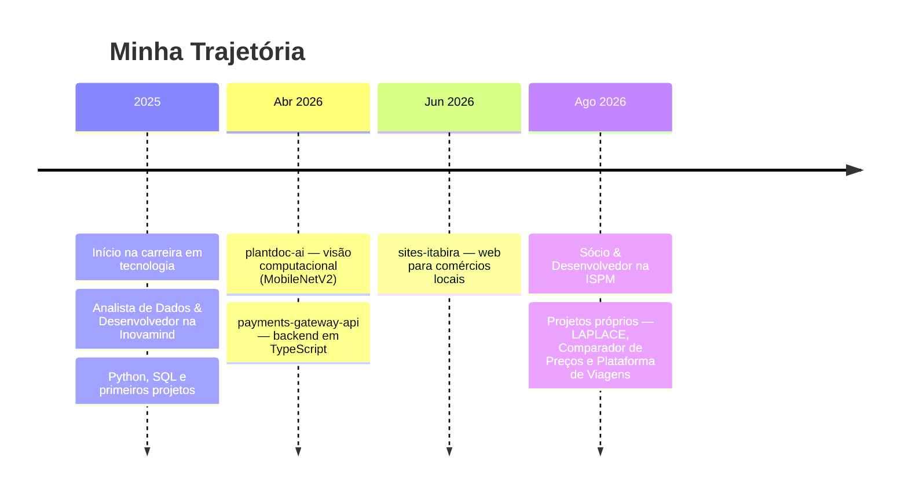
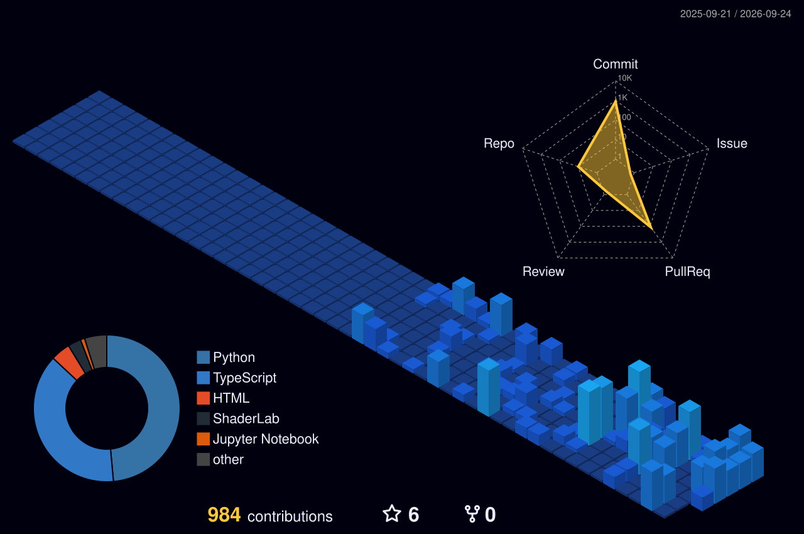

<b>🇧🇷 Português</b> &nbsp;·&nbsp; <a href="./README.en.md">🇺🇸 English</a>

<!-- HEADER BANNER -->

<!-- TYPING SVG -->

 

<!-- SOCIAL BADGES -->

---

## 👋 Sobre Mim

- 🤝 **Sócio & desenvolvedor** na **ISPM Consultoria & Facilities**
- 🎓 Estudante de **Engenharia da Computação**
- 🤖 Desenvolvo **agentes de IA conversacionais** (vendas/atendimento) — Python, RAG, APIs de LLM, WhatsApp
- 🛠️ **Backend & full-stack** — TypeScript, Node.js, Next.js, React, FastAPI, Tailwind, Supabase
- 📊 **Análise de dados** — Python (Pandas, NumPy), SQL, PostgreSQL
- 📱 Também desenvolvo **apps mobile** (iOS/Android), **jogos** (Unity) e domino **arte digital** (Krita)
- 💼 **Experiências:** [ISPM Consultoria & Facilities](https://ispmtecnologia.com.br) · [Inovamind](https://www.inovamind.dev)

> Transformo ideias em produto: da automação com IA ao backend que segura a operação.

---

## 🚀 Projetos

<table>
<tr>
<td width="33%" valign="top">

**💰 [Comparador de Preços](https://comparador-precos-mvp.vercel.app)** 
Análise automática de **NF-e**: lê o XML, classifica por categoria e aponta o fornecedor mais barato + alerta de aumento atípico. 
`Next.js` `React` `Supabase` 
🔗 No ar · 🔒 Código privado

</td>
<td width="33%" valign="top">

**✈️ [Plataforma de Viagens](https://viagem-caldas-novas.vercel.app)** 
3-em-1: rateio de grupo, busca de hotéis ao vivo (LiteAPI) e portal do parceiro. Serverless + Supabase. 
`Vercel` `Serverless` `Supabase` 
🔗 No ar · 🔒 Código privado

</td>
<td width="33%" valign="top">

**🎬 [Hora de Dramear](https://horadedramear.com.br)** 
Plataforma de conteúdo para fãs de doramas: blog, newsletter, votação, awards e busca. 
`Web` `SEO` `Conteúdo` 
🔗 No ar · 🔒 Código privado

</td>
</tr>
<tr>
<td width="33%" valign="top">

**📈 [Contempla Já](https://contempla-ja.alexandreediego220.workers.dev/#/app)** 
Simulador de probabilidade de contemplação de consórcios, com login por convite e histórico por vendedor. 
`React` `Supabase` `Cloudflare Workers` 
🔗 No ar · 🔒 Código privado

</td>
<td width="33%" valign="top">

**🏢 [Site ISPM](https://ispm.com.br)** 
Site institucional da ISPM com o *Mapeamento ISPM* — questionário de 10 etapas que gera leads. 
`Static` `Supabase` `Edge Functions` 
🔗 No ar · 🔒 Código privado

</td>
<td width="33%" valign="top">

**🤖 Agente IA de Vendas 24/7** 
Agente conversacional no WhatsApp com arquitetura de *ports* plugáveis (catálogo, frete, pagamento, CRM). 
`Python` `RAG` `LLM APIs` 
🔒 Código privado

</td>
</tr>
<tr>
<td width="33%" valign="top">

**💳 [payments-gateway-api](https://github.com/diego-caldeira-12/payments-gateway-api)** 
Gateway de pagamento (mock): idempotência, webhooks e processamento assíncrono. 
`TypeScript` `Node.js` 
`</>` Código público

</td>
<td width="33%" valign="top">

**🌿 [plantdoc-ai](https://github.com/diego-caldeira-12/plantdoc-ai)** 
Visão computacional para identificar doenças em plantas (MobileNetV2, transfer learning). 
`Python` `TensorFlow` 
`</>` Código público

</td>
<td width="33%" valign="top">

**🏬 [sites-itabira](https://github.com/diego-caldeira-12/sites-itabira)** 
Sites profissionais para comércios de Itabira/MG. 
`HTML` `CSS` `JS` 
`</>` Código público

</td>
</tr>
<tr>
<td width="33%" valign="top">

**🧠 LAPLACE** 
Plataforma autônoma de pesquisa quantitativa para trading: multiagente, backtesting e módulo de risco com veto (*LLMs nunca decidem trades*). 
`Python` `Quant` `Multiagente` 
🔒 Código privado

</td>
<td width="33%" valign="top">

**📊 Painéis de conciliação & gestão** 
Dashboards SaaS para operação financeira e logística. 
`React` `Node.js` `PostgreSQL` 
🔒 Código privado

</td>
<td width="33%" valign="top">

**📱 Apps mobile** 
Aplicativos iOS + Android para operação logística. 
`Mobile` `iOS` `Android` 
🔒 Código privado

</td>
</tr>
</table>

---

## 🛠️ Tech Stack

**Linguagens**
 

**IA & Automação**
 

**Backend & Web**
 

**Bancos de Dados**
 

**DevOps, Testes & Ferramentas**
 

**Mobile, Jogos & Design**
 

<b>📋 Lista completa de habilidades</b>

 

| Categoria | Tecnologias |
|-----------|-------------|
| **Linguagens** | TypeScript, JavaScript, Python, C#, C++, Java, HTML, CSS, SQL, Bash, PowerShell |
| **IA & Automação** | Claude / Claude Code, OpenAI, APIs de LLM, Agentes de IA conversacionais, RAG, n8n, WhatsApp API, TensorFlow |
| **Backend & Web** | Node.js, Next.js, React, Vite, FastAPI, Tailwind, shadcn/ui, Supabase, Vercel, Jinja2, SQLAlchemy |
| **Dados** | Python (Pandas, NumPy), SQL, Análise de Dados |
| **Bancos de Dados** | PostgreSQL, MySQL, MongoDB, SQLite |
| **DevOps & Infra** | Git, GitHub, GitHub Actions, Docker, Linux, Cloudflare, VS Code, Sentry |
| **Testes & APIs** | Vitest, Playwright, Postman, Resend, LiteAPI |
| **Mobile, Jogos & Design** | iOS, Android, Unity, C# Scripting, Blender, Figma, Krita |

---

## 📜 Trajetória

```mermaid
timeline
    title Minha Trajetória
    2025 : Início na carreira em tecnologia : Analista de Dados & Desenvolvedor na Inovamind : Python, SQL e primeiros projetos
    Abr 2026 : plantdoc-ai — visão computacional (MobileNetV2) : payments-gateway-api — backend em TypeScript
    Jun 2026 : sites-itabira — web para comércios locais
    Ago 2026 : Sócio & Desenvolvedor na ISPM : Projetos próprios — LAPLACE, Comparador de Preços e Plataforma de Viagens
```

---

## 📊 GitHub Stats

  

  

---

## 📈 Atividade

 

---

## 🏙️ Skyline 3D das Contribuições

<picture>
  
</picture>

> *Skyline 3D das minhas contribuições — atualizado automaticamente via GitHub Actions*

---

## 🎵 Ouvindo Agora

---

<b>❤️ De <a href="https://github.com/diego-caldeira-12">Diego Caldeira</a></b>

