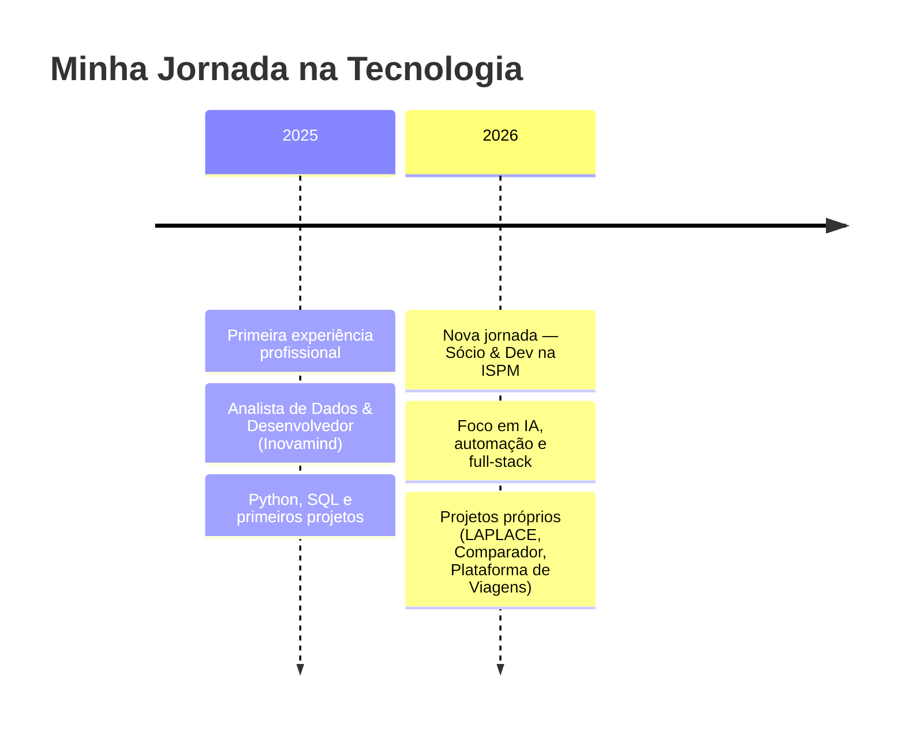

<div align="center">

<b>🇧🇷 Português</b> &nbsp;·&nbsp; <a href="./README.en.md">🇺🇸 English</a>

<!-- HEADER BANNER -->


<!-- TYPING SVG -->
<a href="https://git.io/typing-svg">
  
</a>

<br/>

<!-- SOCIAL BADGES -->
<a href="https://www.linkedin.com/in/diego-caldeira-60148519b/">
  
</a>
<a href="https://www.instagram.com/diegocaldeira_/">
  
</a>
<a href="https://github.com/diego-caldeira-12">
  
</a>


</div>

---

## 👋 Sobre Mim

- 🤝 **Sócio & desenvolvedor** na **ISPM Consultoria & Facilities**
- 🎓 Estudante de **Engenharia da Computação**
- 🤖 Construo **agentes de IA conversacionais** (vendas/atendimento) — Python, RAG, APIs de LLM, WhatsApp
- 🛠️ **Backend & full-stack** — TypeScript, Node.js, Next.js/React, Supabase
- 📊 Base sólida em **análise de dados** (Python, SQL)
- 💼 Antes: **Inovamind** (analista de dados & desenvolvedor) — hoje em nova jornada na ISPM
- 🎮🎨 Também curto **jogos** (Unity) e **arte digital** (Krita)

> Transformo ideias em produto: da automação com IA ao backend que segura a operação.

---

## 🚀 Produtos & Projetos

<table>
<tr>
<td width="33%" valign="top">

**💰 Comparador de Preços**

Análise automática de **NF-e**: lê o XML, classifica por categoria e aponta o fornecedor mais barato + alertas de aumento atípico.

`Next.js` · `React` · `Supabase`
<br/>🔒 código privado · em piloto

</td>
<td width="33%" valign="top">

**✈️ [Plataforma de Viagens](https://viagem-caldas-novas.vercel.app)**

3-em-1: rateio de grupo, busca de hotéis ao vivo (LiteAPI) e portal do parceiro. Serverless + Supabase.

`Vercel` · `LiteAPI` · `Supabase`
<br/>🔗 **no ar**

</td>
<td width="33%" valign="top">

**🎬 [Hora de Dramear](https://horadedramear.com.br)**

Plataforma de conteúdo para fãs de doramas: blog, newsletter, votação, awards e busca.

`Web` · `Conteúdo` · `SEO`
<br/>🔗 **no ar**

</td>
</tr>
<tr>
<td width="33%" valign="top">

**📈 Contempla Já**

Simulador de probabilidade de contemplação de consórcios, com login por convite e histórico por vendedor.

`Vite` · `React` · `Supabase`
<br/>🔒 código privado · fase 1

</td>
<td width="33%" valign="top">

**🏢 [Site ISPM](https://ispm.com.br)**

Site institucional da ISPM com o *Mapeamento ISPM* — questionário de 10 etapas que gera leads.

`Static` · `Supabase` · `Edge Functions`
<br/>🔗 **no ar**

</td>
<td width="33%" valign="top">

**🤖 Agente IA de Vendas 24/7**

Agente conversacional de vendas no WhatsApp com arquitetura de *ports* plugáveis (catálogo, frete, pagamento, CRM).

`Python` · `RAG` · `LLM APIs`
<br/>🔒 privado

</td>
</tr>
</table>

---

## 💻 Código Público

Meus repositórios abertos — onde dá pra ver código de verdade:

| Repositório | O que é | Stack |
|-------------|---------|-------|
| **[payments-gateway-api](https://github.com/diego-caldeira-12/payments-gateway-api)** | Gateway de pagamento (mock): idempotência, webhooks e processamento assíncrono |  |
| **[plantdoc-ai](https://github.com/diego-caldeira-12/plantdoc-ai)** | Visão computacional para identificar doenças em plantas (MobileNetV2, transfer learning) |  |
| **[sites-itabira](https://github.com/diego-caldeira-12/sites-itabira)** | Sites profissionais para comércios de Itabira/MG |  |

---

## 🧩 Mais trabalho

- 🧠 **LAPLACE** — plataforma autônoma de pesquisa quantitativa para trading (multiagente, backtesting, módulo de risco com veto; *LLMs nunca decidem trades*). `🔒 privado`
- 📊 **Painéis de conciliação & gestão** — dashboards SaaS para operação financeira e logística. `🔒 privado`
- 📱 **Apps mobile** — aplicativos iOS + Android para operação logística. `🔒 privado`

---

## 🛠️ Tech Stack

<div align="center">

**Linguagens**
<br/>


**IA & Automação**
<br/>


**Backend & Web**
<br/>


**Bancos de Dados**
<br/>


**DevOps & Ferramentas**
<br/>


**Também**
<br/>


</div>

<details>
<summary><b>📋 Lista completa de habilidades</b></summary>
<br/>

| Categoria | Tecnologias |
|-----------|-------------|
| **Linguagens** | TypeScript, JavaScript, Python, C#, C++, Java, HTML, CSS, SQL |
| **IA & Automação** | Agentes de IA conversacionais, RAG, APIs de LLM, n8n, WhatsApp API, TensorFlow |
| **Backend & Web** | Node.js, Next.js, React, FastAPI, Tailwind, Supabase, Vercel |
| **Dados** | Python (Pandas, NumPy), SQL, Análise de Dados |
| **Bancos de Dados** | PostgreSQL, MySQL, MongoDB, SQLite |
| **DevOps & Ferramentas** | Git, GitHub, Docker, Linux, VS Code |
| **Também** | Unity, C# Scripting, Blender, Figma, Krita |

</details>

---

## 📜 Trajetória

<div align="center">


```mermaid
timeline
    title Minha Jornada na Tecnologia
    2025 : Primeira experiência profissional
         : Analista de Dados & Desenvolvedor (Inovamind)
         : Python, SQL e primeiros projetos
    2026 : Nova jornada — Sócio & Dev na ISPM
         : Foco em IA, automação e full-stack
         : Projetos próprios (LAPLACE, Comparador, Plataforma de Viagens)
```

</div>

---

## 📊 GitHub Stats

<div align="center">


<br/><br/>


</div>

---

## 📈 Atividade

<div align="center">


<br/>


</div>

---

## 🏙️ Skyline 3D das Contribuições

<div align="center">

<picture>
  
</picture>

> *Skyline 3D das minhas contribuições — atualizado automaticamente via GitHub Actions*

</div>

---

## ⏱️ Tempo de Código

<div align="center">

<!--START_SECTION:waka-->
```
⌛ Coletando dados do WakaTime... aparecem aqui automaticamente.
```
<!--END_SECTION:waka-->

</div>

---

## 🎵 Ouvindo Agora

<div align="center">

[](https://spotify-github-profile.kittinanx.com/api/view?uid=ubcxazybcxy2yaqjy7npdgnub&redirect=true)

</div>

---

<div align="center">


<b>❤️ De <a href="https://github.com/diego-caldeira-12">Diego Caldeira</a></b>

</div>
